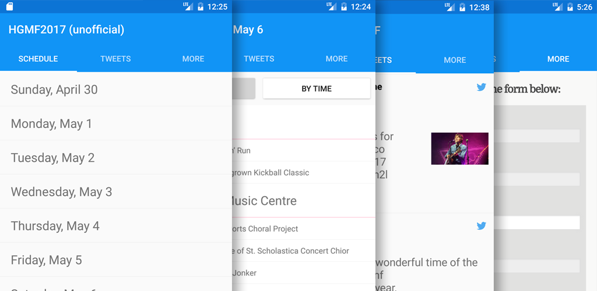
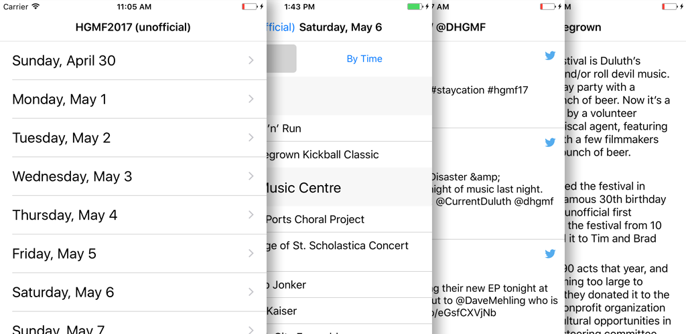

# HGMF2017
The unofficial app of the 2017 Duluth Homegrown Music Festival

## Get the apps

### [iOS](https://itunes.apple.com/us/app/hgmf2017-unofficial/id1229131015)

### [Android](https://play.google.com/store/apps/details?id=com.joesauve.duluthhomegrown2017)

## Screenshots

## Setup

### App
1. Install [Visual Studio 2017](https://www.visualstudio.com/downloads/)(free Community Edition works great) + the optional Xamarin tools during installation OR install [Visual Studio for Mac](https://www.visualstudio.com/vs/visual-studio-mac/).
2. Open `DuluthHomegrown2017.sln` in Visual Studio (either version).
2. Rename the [`DuluthHomegrown2017/SettingsTemplate.cs`](https://github.com/jsauve/HGMF2017/blob/96ae75fc02c1565f85a9ee5b5a505c99fa8339a1/DuluthHomegrown2017/SettingsTemplate.cs) file to `DuluthHomegrown2017/Settings.cs`. Note that `SettingsTemplate.cs` is excluded from the solution intentionally, so you'll need to rename this file via your file system. When you do this, the `Settings.cs` file that Visual Studio may have complained is missing will now be present in the solution.
3. Replace all the values in `Settings.cs` with your various API keys. 

#### NOTE
You may not need all the API keys that you see in `Settings.cs`. If you poke around in the code, you'll see that I'm using some services for crash reporting and analytics, like Pyze and HockeyApp. If you don't need these, then just remove the few lines of code that enable these things:
- [HockeyApp in iOS](https://github.com/jsauve/HGMF2017/blob/96ae75fc02c1565f85a9ee5b5a505c99fa8339a1/iOS/AppDelegate.cs#L24-L26)
- [HockeyApp in Android](https://github.com/jsauve/HGMF2017/blob/96ae75fc02c1565f85a9ee5b5a505c99fa8339a1/Droid/MainActivity.cs#L44-L45)
- [Pyze in iOS](https://github.com/jsauve/HGMF2017/blob/96ae75fc02c1565f85a9ee5b5a505c99fa8339a1/iOS/AppDelegate.cs#L45-L47)
- [Pyze in Android](https://github.com/jsauve/HGMF2017/blob/96ae75fc02c1565f85a9ee5b5a505c99fa8339a1/Droid/Properties/AndroidManifest.xml#L8)

If you want the app to function properly, at the bare minimum you'll need an Azure account (for hosting the Azure Function code) and a Twitter developer account (for pulling in the tweets). Enter the relevant API keys for these services in the `Settings.cs` file.

### Backend
1. Deploy the files from the `Backend` folder to an [Azure Functions](https://azure.microsoft.com/en-us/services/functions/) instance.
2. Update the URL of your Azure Function in the [`DuluthHomegrown2017/Data/AzureFunctionDayDataSource.cs`](https://github.com/jsauve/HGMF2017/blob/96ae75fc02c1565f85a9ee5b5a505c99fa8339a1/DuluthHomegrown2017/Data/AzureFunctionDayDataSource.cs#L27) file.
